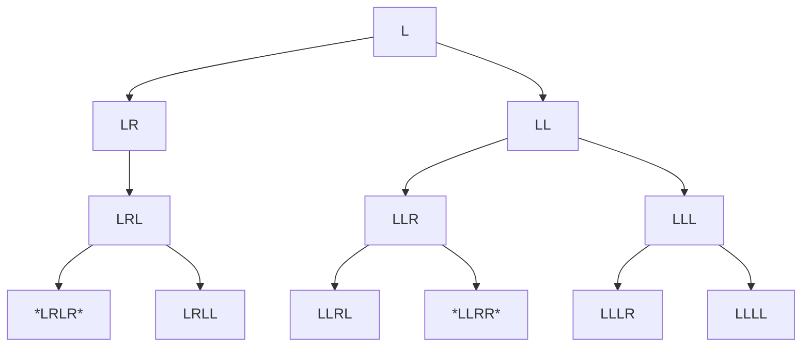

**Case 1: Build new solutions from solutions to subproblems**

Ex. [Pascal's Triangle II](https://leetcode.com/problems/pascals-triangle-ii/ )

![[Screen Shot 2022-10-06 at 5.49.27 PM.png]]

The first line of code is list comprehension that builds out the pascal triangle shape with just 1s. The for loop then goes through and uses the [Pascal's Identity](https://artofproblemsolving.com/wiki/index.php/Pascal%27s_Identity) to build the triangle:

$$
{n \choose k } = {n-1 \choose k} + {n-1 \choose k-1}
$$

This is the case because the possibilities of chooseing k items from n can be broken down into 2 decisions: either you don't take one from the current n and it becomes n-1 choose k, or you do take one and now you choose k-1 from n-1.

-----------------------------------------------------------------------

**Case 2: Build solutions from a tree of all possibilities**

Ex. [Generate Parantheses](https://leetcode.com/problems/generate-parentheses/)

![[Screen Shot 2022-10-06 at 6.53.32 PM.png]]

In this case, I built out the tree of all possibilities and added appropriate leaves to my results:

Only in cases where the count of L and R are equal, is the case valid.

-----------------------------------------------------------------------

