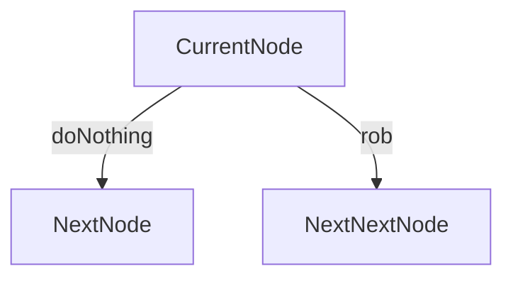

Top down memoization is an alternative solution to bottom up dynamic programming with a similar time complexity although bestcase linear space complexity (due to recursive stack frames).

Ex. [House Robber](https://leetcode.com/problems/house-robber/)

![[Screen Shot 2022-10-06 at 7.27.05 PM.png]]

Try to break this problem down into a single frame to see what you can do in each case.

When we doNothing and skip to the next house, we don't get any money. When we rob the current house, we get the money at the current house and we move 2 houses down.

Ex. [House Robber II](https://leetcode.com/problems/house-robber-ii/submissions/)

![[Screen Shot 2022-10-06 at 7.45.29 PM.png]]

Does the same thing as before except that it keeps track of whether or not we have robbed the first house. Pay particular attention to how I decided to memoize the function (using a tuple). You need to realize that dfs(index, True) and dfs(index, False) can produce two different values and so they must be memoized separately. **You can use tuples for easy parameter storage.**
